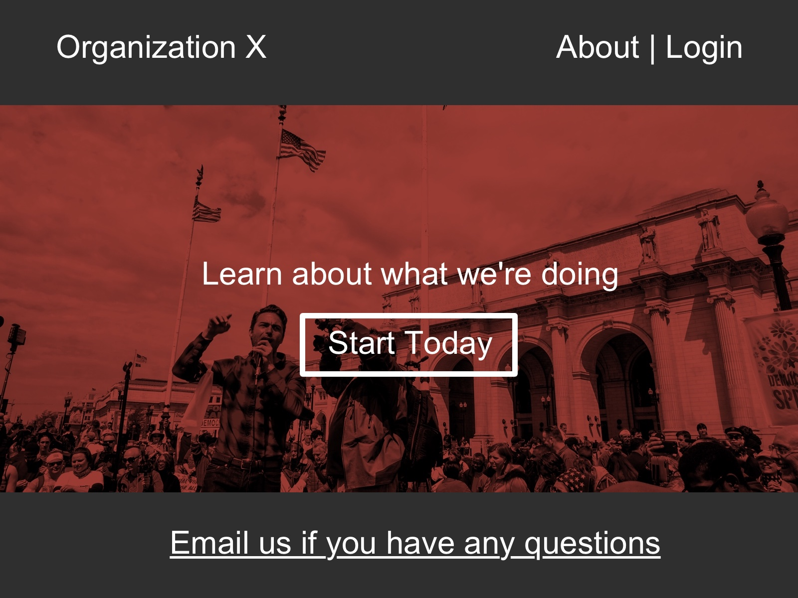

#Pop Quiz

By yourself, see if you can build this page in about 15-20 minutes.

Keep in mind the CSS properties we've learned, relative file linking, HTML semantics and the box model. You'll need to use all four to get this done. Good luck.

Don't freak out if you can't do this - I'm pushing you to get better. [hugs]

We'll go over it together. 
